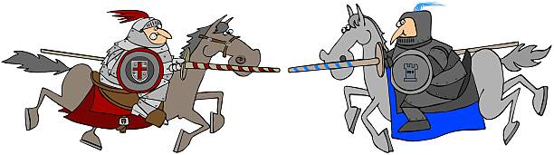
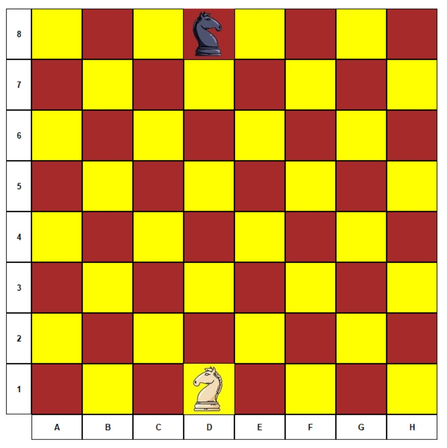
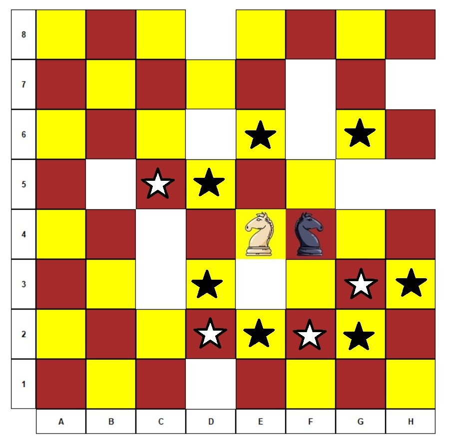

# Joust
Final project for course 20596: Prolog programming and aspects to artificial intelligence. \

## Background
Joust is a two-player abstract strategy board game that may be considered a two-player variant of the knight's tour. It may also be considered a chess variant. It uses a 8 x 8 checkered board, and two Chess knights as the only game pieces. Each player has one knight of a different color from the other player. The knights move as in the game of Chess, but the square it leaves (upon making a move) becomes "burned", that is, it can no longer be moved upon. As the game progresses, fewer squares are available to be moved upon. The objective is to prevent your opponent's knight from performing a move on its turn. (source: [Wikipedia](https://en.wikipedia.org/wiki/Knight%27s_tour#Joust))

The start position of the game:

A possible endgame position. It is the white knight's turn, but it has no where to move, therefore, the black knight wins.

## How to play the game
1. Install the [latest stable release](https://www.swi-prolog.org/download/stable) of SWI-Prolog
2. Run the `start.bat` file
3. The game should start automatically. If for some reason it doesn't, just type `joust.` from the SWI-Prolog interface.
4. Once the game begins, left-click on a square to order your knight to go over.

## Configuration
The game has a configuration file simply named `config`, you can use any text editor to edit it and customize the game. Currently, the supported configuration options are:
* `board_dimensions(X,Y)`: Sets the size of the game board. X and Y are assumed to be positive integer values.
* `difficulty(Level)`: Sets the difficulty of the game. `Level` can by any of `novice`, `easy`, `medium`, `hard`, `ultra` or `demigod`.

## AI
The AI of the game is based on the Alpha-Beta algorithm as it appears on page 585 in the textbook, where black takes the role of the MAX player while white takes the role of the MIN player. The heuristic function `staticval` evaluates a given position as follows:
* If it's the white player's turn and it has no legal moves, then the value is +1000 (guaranteed black win).
* Otherwise (white has at least one move), if it's the white player turn and black has no legal move to perform then the value is -1000 (guaranteed white win).

The case for the black player is symmetric:
* If it's the black player's turn and it has no legal moves, then the value is -1000 (guaranteed white win).
* Otherwise (black has at least one move), if it's the black player turn and white has no legal move to perform then the value is 1000 (guaranteed black win).

For non-terminal game positions, the heuristic function simply estimates its value as the number of legal moves for the black - the number of legal moves for the white. Therefore, the algorithm should prefer positions for which black has plenty of options for continuation while white has fewer.

For example, in the screenshot below we can see a state where the black knight has 7 possible moves, while the white knight has only 4. As a result, the heuristic function will evaluate this state as `7 - 4 = 3`.

The difficulty of the game (see [Configuration](#Configuration)) sets the maximal search depth of the game tree. The values corresponding to the different difficulty levels are summarized in the following table:

| Difficulty | Search depth |
|------------|--------------|
| novice     | 1            |
| easy       | 2            |
| medium     | 3            |
| hard       | 4            |
| ultra      | 5            |
| demigod    | 6            |

Based on some tests we've done, it's possible to play the game of it's highest difficulty (`demigod`) on 10x10 boards and expect the AI to make a move within a reasonable amount of time (usually couple of seconds).

## Source code organization
The project is comprised out of the following files and directories: \
* `src/ai.pl`: Contains the implementation for the alpha-beta algorithm, as well as some auxillary predicates (`staticval`, `betterof`, etc.). \
* `src/gui.pl`: Contains predicates for rendering the game board, handling user input, etc. Based on [XPCE](https://www.swi-prolog.org/packages/xpce/). \
* `src/moves.pl`: Defines the legal moves for a knight on a chessboard. \
* `src/joust.pl`: Main game logic. Responsible for GUI initialization, turn switching, annoncing the winner, etc. \
* `start.bat`: A small batch script to kick off the game. \
* `config`: Configuration file for the game (see [Configuration](#Configuration)). \
* `knights`: Directory that contains JPEG images of the knights used in the game. \
* `images`: Directory that contains JPEG images referenced by this `README.md` file. \

## Authors
* Assaf Carlsbad
* Igor Tsemakhovich
